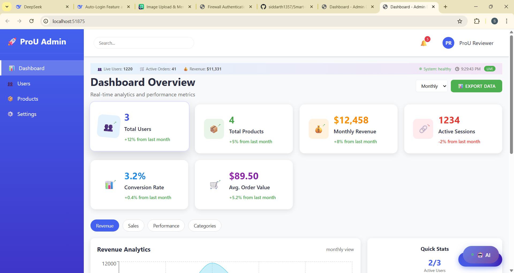
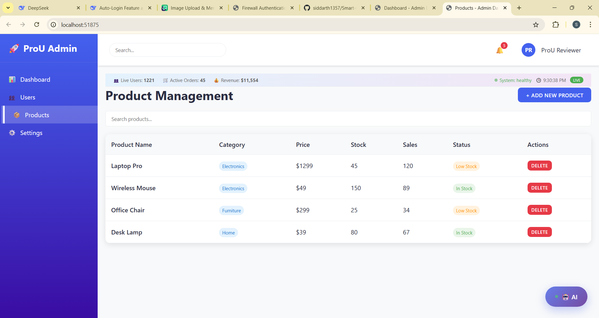

# 🚀 Smart Dashboard System

A responsive, feature-rich admin dashboard built with modern frontend technologies. Designed for real-time analytics, intuitive navigation, and seamless user experience across devices.

---# ProU Frontend Assessment

A responsive frontend application built with modern web technologies.

## 🚀 Quick Setup

Follow these steps to run the project locally:

### Prerequisites
- Node.js (version 14 or higher)
- npm or yarn

### Installation

1. **Clone the repository**
   ```bash
   git clone https://github.com/your-username/Smart-Dashboard-System.git
   cd your-repo-name

   npm install

   npm start

## 📸 Screenshots & Demo

### 🌐 Live Application  
**Live Demo**: [https://smart-dashboard-system.netlify.app](https://smart-dashboard-system.netlify.app)

---

### 📊 Dashboard Views

[](https://smart-dashboard-system.netlify.app)  
*Main dashboard with real-time metrics and charts*

[](https://smart-dashboard-system.netlify.app)  
*Dark theme with professional styling*

---

### 📱 user Experience

[](https://smart-dashboard-system.netlify.app)  
*Fully responsive design on mobile devices*

---

---

## 🛠️ Tech Stack

- **Frontend**: React.js, Chart.js, CSS Modules
- **Routing**: React Router
- **Deployment**: Netlify
- **Version Control**: Git & GitHub

---

## 📦 Features

- Real-time charts and analytics
- Dark/light theme toggle
- Voice command navigation
- Mobile-first responsive design
- Modular component architecture

---

## 📁 Project Structure
